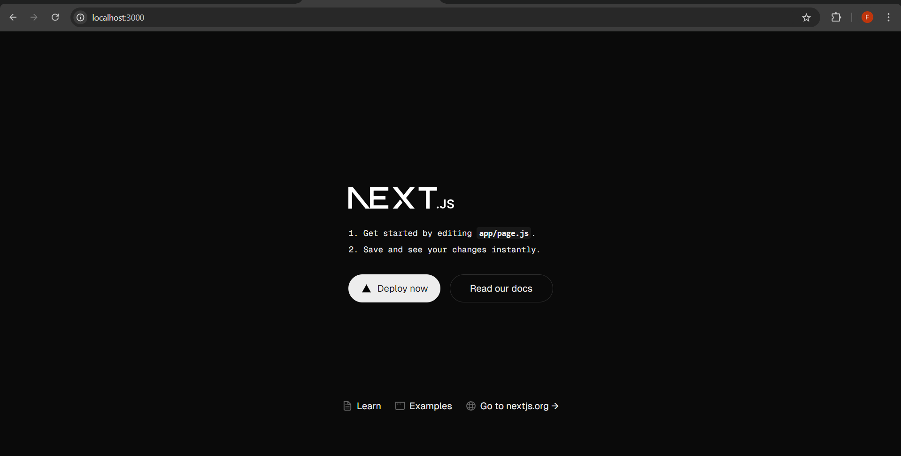
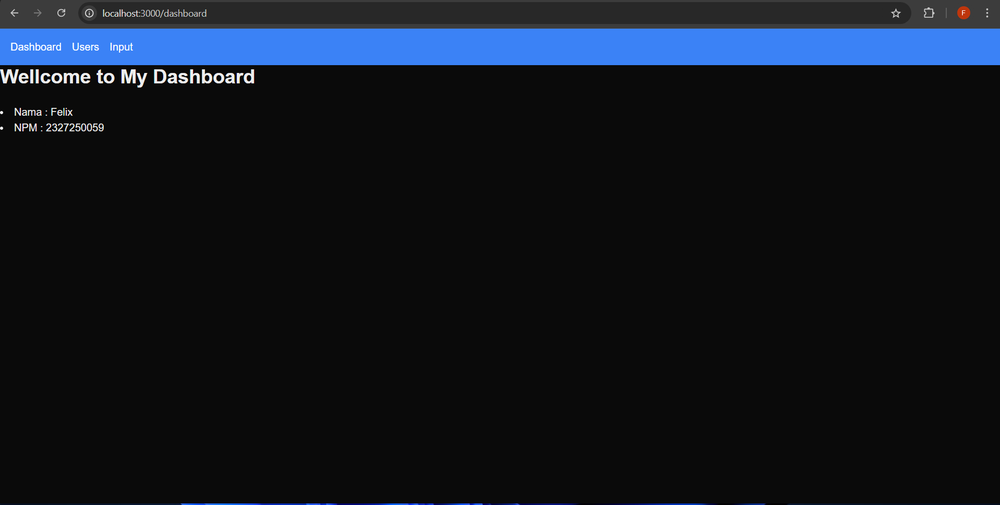
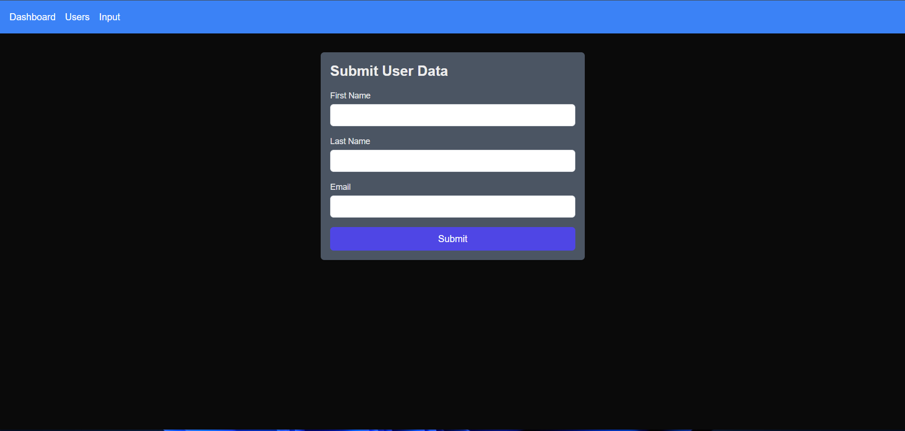
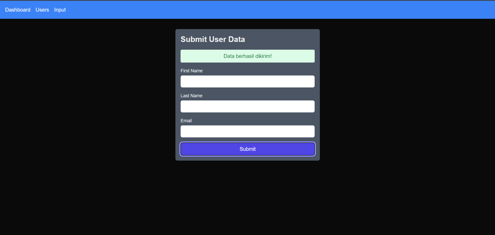

# Nama : Felix
# NPM  : 2327250059

## API (Application Programming Interface)
    Api adalah suatu data yang bisa di buat dan disebarkan dengan cara local maupun online, dalam khasus ini menggunakan api secara online. Cara mengaksesnya dengan cara fetch data dengan cara dari next.js ataupun pihak luar dalam khasus ini saya menggunakan axios.

## Axios
    Axios adalah library digunakan untuk membuat permintaan HTTP dari web atau Node.js. Biasanya untuk menggunakan node.js dan juga biasanya untuk mengakses API seperti sekarang.

### Langkah-langkah Penggunaan dengan cara clone
1. Clone
2. Masuk ke dalam Visual Studio Code
3. Buka Terminal ( Ctrl + `)
4. Ketik "cd/react_axios_api"
5. Jalankan dengan ketik di terminal "npm run dev"
Akan tampil Seperti ini

7. Lalu ketik di search "http://localhost:3000/dashboard"
Akan Tampil Seperti ini

8. Klik pada bagian Users
Akan Tampil Seperti ini

9. Klik pada bagian Input
Akan Tampil Seperti ini

10. Ketika berhasi Input
Akan adanya alert

### Langkah-langkah Penggunaan dengan cara Download
1. download (dalam bentuk .zip)
2. Ekstrak, jika selesai
3. Masuk ke dalam Visual Studio Code
4. Buka Terminal ( Ctrl + `)
5. Ketik "cd/react_axios_api"
6. Jalankan dengan ketik di terminal "npm run dev"
Akan tampil Seperti ini

7. Lalu ketik di search "http://localhost:3000/dashboard"
Akan Tampil Seperti ini

8. Klik pada bagian Users
Akan Tampil Seperti ini

9. Klik pada bagian Input
Akan Tampil Seperti ini

10. Ketika berhasi Input
Akan adanya alert
